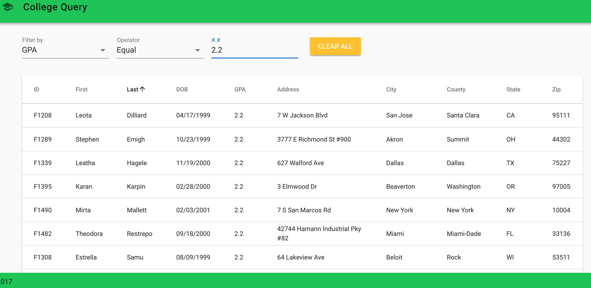
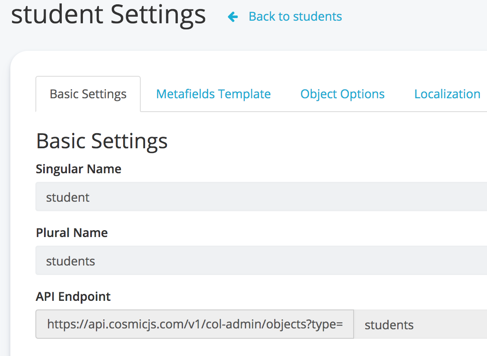

# Add dynamic filters to your data with ease, using Vue, Cosmic JS Rest API.



## TL;DR

* <a href="https://vuejs.org/">Vue</a>
* <a href="https://vuex.vuejs.org/">Vuex</a>
* <a href="https://vuetifyjs.com/en/">Vuetify</a>
* <a href="https://cosmicjs.com/">Cosmic JS</a>

## Intro

Filtering data is one of the most common feature of any data facing application, wheather it's a fron-end app or a back-end application. The Filter function is used to find records in a table or a dataset that meets certain criteria. For examaple if you have a list called Books in a webpage, and you want to show only books that are currently on sale.  You could accomplish this using the filter function.

## What are we building exactly?

In this short tutorial we are building a single page web app, that has two parts. First part would be a list of students. The list will be displayed in a table like structure with multiple columns for each student. Each column will correspond to a data attribute of the student record. The list will also have a summary line at the end that tells you the record count. This is the student data structure:


```
student: {
    id: unique identifier,
    firstName: string,
    lastName: string,
    dob: date (date of birth),
    gpa: number,
    address: string,
    city: string,
    county: string,
    state: string,
    zip: number
}

```

The second part will be the filters that the user can use to filter the data with. Let's assume that the user can filter by any field displayed in the list. So to build generic filter functions, that can be used with multiple fields, we will need to group these filters by data type. And each data type will allow certain comparison operators. The following table illustrate this logic.


```
    string: [contains, startWith]
    date: [equal, greaterThan, lessThan, between]
    number: [equal, greaterThan, lessThan, between]
    lookup: [is, isNot]
```

So basically we can build 12 comparison function that we can use with all our fields or any fields that we may add in the future. So let's get started with our app and see how we can build these features.

## Starting you Vue app

To start a new app, you will need to install <a href="https://vuejs.org/">Vue</a> and open new terminal window and type the following:


```
# initiating new Vue app
vue create col-admin

Vue CLI v3.0.0-rc.9
┌───────────────────────────┐
│  Update available: 3.5.1  │
└───────────────────────────┘
? Please pick a preset: Manually select features
? Check the features needed for your project: Babel, Router, Vuex, Linter
? Pick a linter / formatter config: Standard
? Pick additional lint features: Lint on save
? Where do you prefer placing config for Babel, PostCSS, ESLint, etc.? In dedicated config files
? Save this as a preset for future projects? No

# adding other js libraries
vue add vue-cli-plugin-vuetify
? Choose a preset: Default (recommended)
✔  Successfully invoked generator for plugin: vue-cli-plugin-vuetify

# adding the backend library
npm install --save cosmicjs

```

after this we should have our starter application ready to be customized. If you want to run the app, just open the terminal window and type `npm run serve` and then open the application from your browser from this app default url `http://localhost:8080/` and you're good to go to the next step.

## Setup you Rest API with Cosmic JS

As we mentioned earlier, the goal of this app is to display a list of students, and then use the filter functionality to narrow down the list. For this project we will use Cosmic JS to store our data, and also to server the data using the built-in Rest API that comes with Cosmic JS.

* Signup for a free <a href="https://cosmicjs.com/pricing">Cosmic JS</a> account.
* Add new bucket from the <a href="https://cosmicjs.com/buckets">develpment dashboard</a>
* Add new `Object Type` from the dashboard. and specify the following attributes for this object type

* From the object type metafields tab, add the following fields:

```
    SID: text field,
    firstName: text field,
    lastName: text field,
    DOB: text field,
    GPA: text field,
    Address: text field,
    City: text field,
    County: text field,
    State: text field,
    Zip: text field
```

* Add some data into the Students table. If you want you can copy my data table from Cosmic JS by importing my <a href="https://cosmicjs.com/col-admin/dashboard">col-admin-bucket</a> under your account. I have inserted about 300 records, so you don't have to type all these information manually.

* Access your Cosmic JS data via the built-in Rest API from this url: `https://api.cosmicjs.com/v1/col-admin/objects?type=students`

* Take a look to the <a href="https://cosmicjs.github.io/rest-api-docs/?javascript">Cosmic JS API Documentations</a> for a detailed list of all the APIs available for you.

After this you should be able to access you backend data via the Rest API.

## Add data store using Vuex

Under our project root folder lets add new folder `./src/store/` and move `./src/store.js` under the store folder.
We will also need to create new file under './src/api/cosmic.js'

```
const Cosmic = require('cosmicjs')

const config = {
    bucket: {
        slug: process.env.COSMIC_BUCKET || 'col-admin',
        read_key: process.env.COSMIC_READ_KEY,
        write_key: process.env.COSMIC_WRITE_KEY
    }
}

module.exports = Cosmic().bucket(config.bucket)

```

This small script will be used as Cosmic JS connection object.

We will also need to create new file under `./src/store/modules/cosmic.js` for all the Cosmic JS data related functions.

```
import Cosmic from '../../api/cosmic' // used for Rest API

const actions = {
    async fetchStudents ({commit, dispatch}) {
        const recordLimit = 25
        let skipPos = 0
        let fetchMore = true

        while (fetchMore) {
            try {
                const params = {
                    type: 'students',
                    limit: recordLimit,
                    skip: skipPos
                }
                let res = await Cosmic.getObjects(params)
                if (res.objects && res.objects.length) {
                    let data = res.objects.map((item) => {
                        return {...item.metadata, id: item.metadata.sid,
                            firstName: item.metadata.firstname,
                            lastName: item.metadata.lastname }
                    })
                    commit('ADD_STUDENTS', data)
                    commit('SET_IS_DATA_READY', true)
                    // if fetched recodrs lenght is less than 25 then we have end of list
                    if (res.objects.length < recordLimit) fetchMore = false
                } else {
                    fetchMore = false
                }
                skipPos += recordLimit
            }
            catch (error) {
                console.log(error)
                fetchMore = false
            }
        }
        dispatch('fetchStates')
    }
}

export default {
    actions
}
```

So far, we only have one function `fetchStudents`. This function will call the Cosmic JS `getObjects` to pull 25 records at a time. And it will do this inside a while loop until we reach the end or no more records can be found. We can identify the end of data of the data row count will be less than 25 records. After fetching all data from the Rest API we will call the `ADD_STUDENTS` mutation to store these records inside Vuex state variable. For more info about Vuex store, please read the <a href="https://vuex.vuejs.org">documentation</a>.

There is another call at the end of this function to `fetchStates`. This function will simply loop through all students records and get the unique state code and store it in `states` variable. This can be used later on the filter by state dropdown component.

This is the rest of the Vuex store.

```
import Vue from 'vue'
import Vuex from 'vuex'
import _ from 'underscore'
import cosmicStore from './modules/cosmic'

Vue.use(Vuex)

export default new Vuex.Store({
    state: {
        isDataReady: false,
        students: [],
        states: []
    },
    getters: {
        students (state) {
            return state.students
        },
        isDataReady (state) {
            return state.isDataReady
        },
        states (state) {
            return state.states
        }
    },
    mutations: {
        SET_STUDENTS (state, value) {
            state.students = value
        },
        SET_IS_DATA_READY (state, value) {
            state.isDataReady = value
        },
        ADD_STUDENTS (state, value) {
            state.students.push(...value)
        },
        SET_STATES (state, value) {
            state.states = value
        }
    },
    actions: {
        fetchStates ({commit, state}) {
            let states = []
            states = _.chain(state.students).pluck('state').uniq().sortBy((value) => value).value()
            commit('SET_STATES', states)
        }
    },
    modules: {
        cosmicStore
    }
})

```

## Application styling with Vuetify

For this project we will use <a href="https://vuetifyjs.com/en/getting-started/quick-start">Vuetify</a> as our fron-end components libarary. This is very helpful, especially if you like to use <a href="https://material.io/design/introduction/">Google Material Design</a> into your project without a lot of overhead. Plus Vuetify is awesome because it has tons of built-in UI components that are fully loaded.
After adding Vuetify to your project using Vue CLI add command, you can just reference Vuetify components from your page templates.
Let's take a look at the `App.vue` main layout.

```
<template>
    <v-app>
        <v-toolbar app color="green accent-4">
            <v-icon>school</v-icon>
            <v-toolbar-title v-text="title"></v-toolbar-title>
            <v-spacer></v-spacer>
        </v-toolbar>

        <v-content>
            <router-view/>
        </v-content>

        <v-footer :fixed="fixed" app color="green accent-4">
            <span>&copy; 2017</span>
        </v-footer>
    </v-app>
</template>

<script>

export default {
  name: 'App',
  data () {
    return {
      fixed: false,
      title: 'College Query'
    }
  }
}
</script>
```

In the template above you can see that our application page layout has three sections:
* v-toolbar: wich is the top toolbar component
* v-content: which will contain the inner content of any page
* v-footer: which will have the app copyright and contact info

## Adding application view and components

You may notice that under the './src' folder, there are two folders:
* ./src/components: this folder will be used to store all web components that can be used inside any page. Curretnly we don't any components yet! but if our app become more complex, we could easily break each page into small components.
* ./src/views: This folder is used to store views. A view is the equivilant to a web page. Currently we have the `Home.vue` which is the main page, and the `About.vue`

## Adding datagrid to main page

In the `Home.vue` page we will have two main sections:

* data filters: which contains all filters that the user can select.
* data grid: this the students list displyed as a data grid component. For our purpose we will use Vuetify `data-table` component.

So let's take a look at the home page template:

```
<template>
    <v-container grid-list-lg>
        <v-layout row wrap>
            <v-flex xs2>
                <v-select
                    :items="filterFields"
                    v-model="filterField"
                    label="Filter by">
                </v-select>
            </v-flex>
            <v-flex xs2>
                <v-select
                    :items="filterOperators"
                    v-model="filterOperator"
                    label="Operator">
                </v-select>
            </v-flex>
            <v-flex xs2 v-show="filterOperator && filterType !== 'lookup'">
                <v-text-field
                    name="filterTerm"
                    :label="filterTermLabel"
                    :mask="filterTermMask"
                    :rules='filterTermRules'
                    return-masked-value
                    v-model="filterTerm"
                ></v-text-field>
            </v-flex>
            <v-flex xs2 v-show="filterOperator === 'between'">
                <v-text-field
                    name="filterTerm2"
                    :label="filterTermLabel"
                    :mask="filterTermMask"
                    :rules='filterTermRules'
                    return-masked-value
                    v-model="filterTerm2"
                ></v-text-field>
            </v-flex>
            <v-flex xs2 v-show="filterType === 'lookup'">
                <v-autocomplete
                  :items="filterLookupItems"
                  :label="filterLookupLabel"
                  v-model="filterLookupValue"
                ></v-autocomplete>
            </v-flex>
            <v-flex xs2>
                <v-btn color="warning" @click="onClearAllFilters">Clear All</v-btn>
            </v-flex>
            <v-flex xs12>

                <v-data-table
                    :headers="headers"
                    :items="filteredStudents"
                    xhide-actions
                    :pagination.sync="pagination"
                    :loading="!isDataReady"
                    class="elevation-1">
                    <template slot="items" slot-scope="props">
                        <td>{{ props.item.id }}</td>
                        <td>{{ props.item.firstName }}</td>
                        <td>{{ props.item.lastName }}</td>
                        <td>{{ props.item.dob | shortDate(dateFilterFormat) }}</td>
                        <td>{{ props.item.gpa | gpaFloat }}</td>
                        <td>{{ props.item.address }}</td>
                        <td>{{ props.item.city }}</td>
                        <td>{{ props.item.county }}</td>
                        <td>{{ props.item.state }}</td>
                        <td>{{ props.item.zip }}</td>
                    </template>

                    <template slot="pageText" slot-scope="props">
                        Total rows: {{ props.itemsLength }}
                    </template>

                </v-data-table>

            </v-flex>
        </v-layout>
    </v-container>
</template>
```

As you can see, from the code above. the `v-data-table` component is using `filteredStudents` variable as it's data source. Inside Vuex store we have two state variables:

* students: an array wich contains all students that are fetched from the database.
* filterdStudents: an array wchich contains only the students matching the filter criteria. Intially, if no filter is selected, then this variable will have exact same value as the `students` variable.

The `data-table` component also has three sections:

* headers: currently we store the header in a data variable called headers
* items: this is the data section which is feeding of `filteredStudents` variable
* footer: will display the pagination controls and the record count info

## Adding data filters UI components

As seen in the Home.vue page template the filters components consist of the following components:

* Filter By: currently we have to select one of the available fields like firstName, lastName, dob...
* Filter Operator: this will be something like `Contains`, 'Start with', 'Greater than'... The operators will change based on the field type
* Filter Term: this is the user input for the selected filter. Currently we have two filter terms in case if we need to select a range. For instance if the user selects date of birth between, then we need two date input fields.
* Filter lookup: is a dropdown in case if the filter criteria needs to be selected from a given list. In our app, when we need to filter by State, then we need to selec a value from a a dropdown field.

## Add filter functionality

We can summarize the filter functionality by these variables:

```
    headers: [
        { text: 'ID', align: 'left', sortable: false, value: 'id' },
        { text: 'First', value: 'firstName' },
        { text: 'Last', value: 'lastName' },
        { text: 'DOB', value: 'dob', dataType: 'Date' },
        { text: 'GPA', value: 'gpa' },
        { text: 'Address', value: 'address' },
        { text: 'City', value: 'city' },
        { text: 'County', value: 'county' },
        { text: 'State', value: 'state' },
        { text: 'Zip', value: 'zip' }
    ],
```
This the data table headers.


```
    filterFields: [
        {text: 'First Name', value: 'firstName', type: 'text'},
        {text: 'Last Name', value: 'lastName', type: 'text'},
        {text: 'DOB', value: 'dob', type: 'date'},
        {text: 'GPA', value: 'gpa', type: 'number'},
        {text: 'Address', value: 'address', type: 'text'},
        {text: 'City', value: 'city', type: 'text'},
        {text: 'County', value: 'county', type: 'text'},
        {text: 'Zip', value: 'zip', type: 'number'},
        {text: 'State', value: 'state', type: 'lookup'}
    ],
```
This is the list of filter fields that the user can select. You can also see that I added a type for each filter field. Filter type will be used lated to dicide wchich function will be called to run the filter operations. Many fields will have the same data types, therefore we don't need to call a separate function to filter by that field. We will call the same function for all fields that share the same data type.


```
    filterDefs: {
        text: {contains: {display: 'Contains', function: this.filterByTextContains},
               startsWith: {display: 'Starts with', function: this.filterByTextStartsWith}},
        number: {equal: {display: 'Equal', function: this.filterByNumberEqual, decimalPoint: 1},
                 greater: {display: 'Greater than', function: this.filterByNumberGreater, decimalPoint: 1},
                 less: {display: 'Less than', function: this.filterByNumberLess, decimalPoint: 1},
                 between: {display: 'Between', function: this.filterByNumberBetween, decimalPoint: 1}},
        date: {equal: {display: 'Equal', function: this.filterByDateEqual, format: 'MM/DD/YYYY'},
                 greater: {display: 'Greater than', function: this.filterByDateGreater, format: 'MM/DD/YYYY'},
                 less: {display: 'Less than', function: this.filterByDateLess, format: 'MM/DD/YYYY'},
                 between: {display: 'Between', function: this.filterByDateBetween, format: 'MM/DD/YYYY'}},
        lookup: {is: {display: 'Is', function: this.filterByLookupIs},
                 isNot: {display: 'Is not', function: this.filterByLookupIsNot}}
    },
```
The filterDefs variable will store information that tells our UI which operator to use on each field type. We also specify in this config variable, which Javascript function to call when we need to filter by the selected field. This variable is my own interpretation on how the filter function should be configured and designed, however you can certainly do without it, and use Javascript code with a lot of `if` statements.

The last piece is the actual Javascript functions that we will call for each filter type. I am not going to list all of them, but let's see few examples from the `Home.vue` page


```
    ...
    methods: {
        filterByTextContains (list, fieldName, fieldValue) {
            const re = new RegExp(fieldValue, 'i')
            return this.filterByRegExp(list, fieldName, fieldValue, re)
        },
        filterByTextStartsWith (list, fieldName, fieldValue) {
            const re = new RegExp('^' + fieldValue, 'i')
            return this.filterByRegExp(list, fieldName, fieldValue, re)
        },
        filterByRegExp(list, fieldName, fieldValue, regExp) {
            return list.filter(item => {
                if(item[fieldName] !== undefined) {
                    return regExp.test(item[fieldName])
                } else {
                    return true
                }
            })
        },
    ...
    }

```
The code above have two functions `filterByTextContains` and `filterByTextStartsWith` which will be called each time the user uses the text field filter function. And behind those two functions we call `filterByRegExp` which is basically a function that uses Javascript Regular expression function.
In a similar way I have written filter functions for numeric fields, for date fields, and for lookup fields. I have used simple logic like date comparison, or array find, or plain old JS if statement. The most important part is that these function should be generic enough to work with any field, and expects few parameters like the data list that should be filtered, the field name and the field value.
I encourage you to take a look at the code for <a href="https://github.com/mtermoul/col-admin/blob/master/src/views/Home.vue">Home.vue</a> for the full details.

## Using Vue computed properties, wathcers, and filters

You can also find inside './src/views/Home.vue' a couple methods under computed, watch, and filters. Here is how and why I use each type for.

* Computed: I have used these computed properties for `students`, `filteredStudents`, `isDataReady`, `states`. these properties will update automaticaly anytime the underlying variables which comes from Vuex store changes. This is useful especially if you bind the computed properties to the UI elements, and make UI changes or toggle between UI sections whenever the data inside the computed properties got updated. For instance `isDataReady` is used in the data table whenever it's `false` then the UI will play a waiting animation progress bar that tells the user that the data is loading. Once the `idDataReady` is updated to `true`, then the is loading progress bar will disappear, and the table will show the actual data.

* Watchers: I have used these watched properties `filterField`, and `filterOperator`. the difference is that the watched properties does not cache the value, and each time the underlying data changes, the function will be called. I have used this to update the filter UI elements on the home page.

* Filters: don't get confused Vue filters with data filtering. Filters are functions that you define in the logic, then use inside the html template to format a field value. For instance I have `shortDate`, and `gpaFloat` functions which are used to format date and float values to the desired display format. You can call the filter function from the html template using this syntax `<td>{{ props.item.gpa | gpaFloat }}</td>`.

I also want to mention that I have used Vue life cycle event hooks to initiate the data fetching from the back end whenever the application starts. I am doing that from the `./main.js` file


```
...
new Vue({
  store,
  router,
  render: h => h(App),
  created () {
    this.$store.dispatch('fetchStudents')
  }
}).$mount('#app')
```
As you can see, on app created event we are calling Vuex action by invoking the dispatch methods. this is very useful if you want to trigger actions automatically without waiting for user actions.

## Conclusion

At the end, I want to mention that building simple application like this sounds easy, however building an expandable app can take some thinking and a little planing to make sure that your code can easily allow future expanssions and changes without the need to rewrite the app.
Also worth mentioning that, using an API ready back-end did certainly save us a lot of time. Lastly I want to add that after finishing the app I realize that the the Home.vue page could certainly be broken up into small components, and make it more readable and maintainable. So that would probably be the next step if you ever want to make a use of Vue Components.

So, try the application <a href="http://col-admin.cosmicapp1.co">demo</a>, take a look at the <a href="https://github.com/mtermoul/col-admin">source code</a> and let me know what you think.
